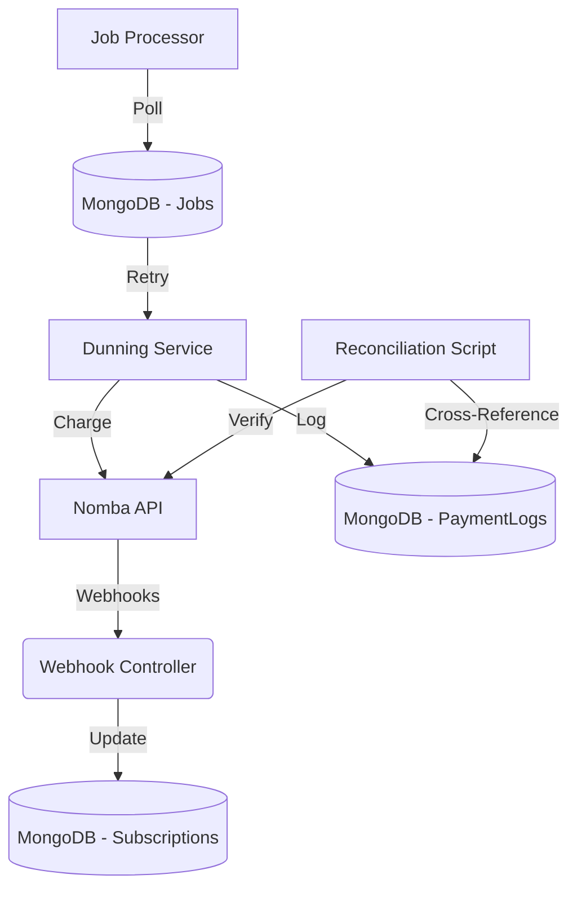

# Nomba Subscription Engine

An autonomous, resilient billing layer for Nigerian merchants, designed to minimize revenue leakage through smart dunning and automated reconciliation.

## 📜 The Resilience Manifesto
At Nomba, we believe financial infrastructure must be inherently defensive. Our engine adheres to three core tenets:
1. **Never Assume Connectivity:** Every request is designed for a world where networks fail. We use idempotency, retries, and reconciliation to handle the unpredictable.
2. **Context is King:** We never blindly retry. We classify, analyze, and act based on the *reason* for failure, not just the fact *that* it failed.
3. **Data Integrity is Non-Negotiable:** A local database is only as good as its sync with the source of truth (the Nomba ledger). We reconcile daily to ensure the ledger remains absolute.

## 🚀 The Core Problem: Revenue Leakage
Traditional payment collections often fail due to network instability or expired credentials. Without a systematic recovery process, this leads directly to churn and lost revenue. Our engine solves this by treating billing as a state-machine-driven process.

## 🧠 Nomba API Integration Logic
Our engine treats the Nomba API as an untrusted but essential external dependency.
* **Orchestration:** All interactions go through `nombaService.js`.
* **Resilience:** We wrap all calls in error-handling wrappers that classify results (Transient vs Hard) before updating our internal state machine.
* **Webhook Handling:** Our `webhookController.js` acts as the event bridge, ensuring that external API state changes are reflected in our internal `Subscription` and `PaymentLog` models instantly.

## 🏗️ Architecture

## 🧠 Intelligent Revenue Recovery Architecture
We move beyond blind retries. Our billing engine utilizes an `Error-Based Retry Intelligence` layer to classify failures in real-time, ensuring resources are optimized for success:

1. **Classification:** Every API failure is mapped by our `ErrorClassifier` into categories: `TRANSIENT_NETWORK`, `GATEWAY_DOWN`, `INSUFFICIENT_FUNDS`, or `HARD_FAILURE`.
2. **Event-Driven Orchestration:** 
    - **Transient Errors:** Trigger intelligent, optimized retries (e.g., 5-minute backoff).
    - **Gateway Issues:** The system pauses with a longer backoff (e.g., 1-hour), retrying only when infrastructure is stable.
    - **Insufficient Funds:** Seamlessly triggers our 'User-First Dunning Policy' (transitioning to `pending_auth` state, requiring explicit customer approval).
    - **Hard Failures:** Flagged for immediate cancellation.
3. **Auditability:** Every orchestration decision is immutably logged in the `PaymentLog`, providing complete transparency into the system's reasoning.

### 1. Smart-Dunning Engine (The "Recoverer")
We implement intelligent backoff strategies based on error severity. Every failure is logged with a specific category, allowing merchants to diagnose churn causes instantly and act accordingly.

### 2. User-Consent Layer (The "Gatekeeper")
For logical failures (like insufficient funds), we protect merchant-customer relationships by entering a `pending_auth` state. Customers must explicitly approve retries through the portal (`POST /api/portal/retry-auth`), ensuring compliance and reducing chargebacks.

### 3. Automated Reconciliation (The "Trust-Builder")
A proactive daily audit service cross-references local `PaymentLog` records against the Nomba bank ledger to identify discrepancies, ensuring the billing ledger is always auditable and trustworthy.

### 🛡️ Idempotency Guard (Financial Integrity)
To prevent catastrophic double-charging in high-latency or unstable network environments—a critical pain point for merchants—every sensitive financial API request must include an `x-idempotency-key` header. 

Our enterprise-grade middleware (`middleware/idempotency.js`) validates this key against an atomic record in MongoDB before allowing processing. If a duplicate key is detected, the system immediately returns a `409 Conflict` response, ensuring that even if network timeouts cause retry loops on the client side, the financial ledger remains pristine.

## ⚠️ The "Unhappy Path": How We Handle Failure
1. **Trigger:** A payment request is submitted.
2. **Failure:** The Nomba API returns a "funds insufficient" error.
3. **Automatic Response:** 
    - The transaction is logged as `failed` in `PaymentLog`.
    - Subscription status transitions to `pending_auth`.
    - An automated email is sent to the customer via `notificationService`.
    - **Recovery:** Upon customer approval via the portal, the `gatekeeperService` re-triggers the dunning process for the subscription.

## 📈 Observability Dashboard
We provide real-time visibility into the "Auto-Recovery Rate"—the percentage of `past_due` subscriptions we have successfully brought back to `active`.

---

## 📚 Related Documentation

*   **[Final Submission Checklist](../CHECKLIST.md)**: A roadmap to help track submission progress, aligned with project implementation.
*   **[Root Project README](../README.md)**: The main entry point explaining the Nomba Orchestrator ecosystem, the problem space, and the core dunning/reconciliation business pillars.
*   **[Detailed System Architecture](ARCHITECTURE.md)**: Deep dive into the architectural flow chart, state machine definition, and the robust idempotency layer.
*   **[Project Handoff Guide](HANDOFF.md)**: Quick-start notes, current mock service layers, known scaling bottlenecks, and hackathon transition instructions.
*   **[Dashboard Features Guide](../frontend/FEATURES.md)**: User manual for the live Merchant Console, active system jobs tracking, and mock simulation control panels.

---

*Built to scale, designed for resilience.*
